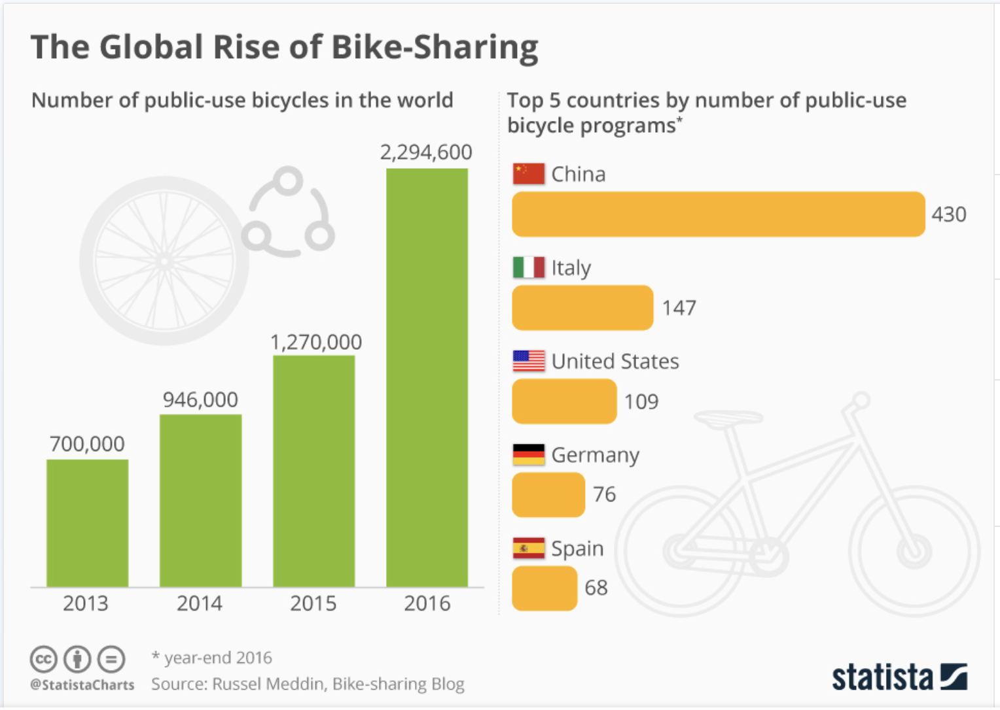

# Bike Sharing Service Business Plan
### Service to be first launched in Des Moines, Iowa

Bike Sharing is on the rise all across the world as people strive to live in crowded areas without owning a personal car. Based on the chart below, China has been leading the way with 430 Bike Sharing programs and it is gaining popularity rapidly in the US. There are still a lot of cities in the US that do not have a strong presence of Bike Sharing services. This presents a huge opportunity for a Bike Sharing Service business to establish itself in these cities and gain market share rapidly and be hugely successful.

### Source: https://www.statista.com/chart/13483/bike-sharing-programs/
## Since we are planning to launch our Bike Sharing service in Des Moines, Iowa, USA first, we will use the ride sharing data available for New York which has had successful programs for quite a while now. It will help us draw comparisons and consider outcomes and help model our business plan for Des Moines. One of the Bike Sharing programs that runs very successfully since 2013 in New York is CitiBike. We have collected the data published by them and will be using them extensively in this business plan.
## To gauge the demand for Bike Sharing Service in Des Moines, we will collect relevant data and answer questions regarding current population, population density, population distribution by age, number of residents and visitors, average commute time and distance, avaibility of retail space. We will make side by side comparisons of the data for Des Moines with that of New York and provide our analysis.
#### What is the current population of Des Moines?
#### Is the population growing or shrinking?
#### What is the population distributed geographically?
#### What is the average commute distance and time?
#### What is the population distribution over age?
#### What is the availability of retain space to setup various points of service for Bike Sharing Service?

Bike Sharing Service Story
Let us take a look at the Bike Sharing Service Story that is presented using Tableau.
## The following link will take you to the Bike Sharing Service Tableau story.
### https://public.tableau.com/profile/priyanka.senapati#!/vizhome/populationgrowth_15846222204320/Bikesharing

## Dashboard - Population Growth
The Population Growth dashboard provides data on current population and population growth trend over the past years. These numbers and trends provides an indication if the service will have a steady supply of new and old customers to make the service sustainable in the long run. Comparisons to New York City and CityBike Program is constantly made to draw inferences.
## Dashboard - Population Density
The Population Density dashboard provides the population distribution across the cities. The higher the population density the higher the congestion and motorized traffic. Also, the points of interest are located closer to each other and some have multiple locations. Also, commute distance between work and home is less but commute time is affected by the traffic. This presents a great potential for a Bike Sharing service to help the people to quickly go from one location to another without being stuck in automotive traffic and get some exercise! Since the density of large businesses and government offices is high, Bike Sharing Service can tie up with some of these organizations to extend subsidized ride sharing service to their employees and workers.
## Dashboard - Customer Type
Our learnings from the CitiBike, New York, bike sharing program is that the bulk of the revenue can be generated from Annual Subscribers. CitiRide Annual Subscribe consists of 81.07 percent of its customer base. If Bike Sharing prices its Annual Subscription in a maner that customers who use the Bike Sharing service for a few weeks in a year get attracted to buying the Annual Subscription, then it will help address two important goals of the Bike Sharing Service. The first one is revenue generation - Daily or weekly customers will be converted to an Annual subscriber which will help drive up revenue and create a sustainable customer base. The second one is Increasing Market Awareness to help convert casual users to Annual Subscribers - After a customer buys an Annual Subscription they will be inclined to use the Bike Sharing service more than before since it is already paid for. This will help move more of the general population into using a green and healthy mode of transportation. These side effects of Bike Sharing has priceless benefits and that will also help cusrtomers keep coming back year after year. If the Annual Subscription pricing for non-residents is positioned in such a maner that even visitors staying for a few weeks in Des Moines will opt for the Annual Subscription, then it will also help Bike Sharing Service achieve its revenue and awareness goals.
## Dashboard - Impact of Tourism
Des Moines's Annual visitors to resident ratio is a whooping 62:1 as compared to just 7:1 for New York. This is an important customer segment that can be targetted to become Annual Subscribers. Not only will it generate revenue, but it will start a trend with the visitors to use the afordable, green and health friendly way to live your life!
## Dashboard - Impact of Age
Based on our analysis of the CitiBike data and comparing that with Des Moines's population distribution by age, we see that the ratios of various age groups in Des Moines closely follows that of NYC and has a good ratio of people who are potential bike users. So there will be a large part of the population who will be able to avail the Bike Sharing Service.
## Dashboard Other influencing factors
### Some of the other important considerations are as follows:
#### Retail Square Footage per Capita:
Availability of retail space per capita drives the cost of setting up a Point of Service. The data shows that the capita retail space in Des Moines is much higher than that of NYC. This indicates that the cost of setting up Points of Service throughout the city will not be a big concern.
#### Mean travel time to work & Average length of trips:
People will choose a Bike Riding service for making short commutes over short distances during the busy week days. The mean travel time and mean travel distance are important considerations for assessing the viability of a Bike Sharing Service. Knowing that people will use a combination of modes of transportation to get to work and back home and will use bikes for short distances also suggests that the Points of Services be clustered closer around areas which are densely populated and have public transit centers and business parks. Many customers like to use the public transportation to avoid looking for parking and paying high parking fees. So solving the last mile problem twice a day makes the Bike Sharing service an important part of their daily transportation solution.
## Information and Data Sources:
#### 1. https://www.census.gov/quickfacts/fact/table/desmoinescityiowa/PST045218#PST045218
#### 2. https://www1.nyc.gov/site/planning/planning-level/nyc-population/population-facts.page
#### 3. https://www.census.gov/quickfacts/fact/table/newyorkcitynewyork,US/PST045219
#### 4. https://worldpopulationreview.com/us-cities/des-moines-population/
#### 5. https://www1.nyc.gov/site/planning/planning-level/nyc-population/current-future-populations.page
#### 6. http://www.undertheraedar.com/2012/01/population-density-in-new-york-city.html
#### 7. https://images.app.goo.gl/dvSBqb7vZLj4kkLMA (Census | the Des Moines Perspective)
#### 8. https://www.citibikenyc.com/system-data
#### 9. https://www.nytimes.com/2019/08/19/nyregion/nyc-tourism.html
#### 10. https://en.wikipedia.org/wiki/Tourism_in_New_York_City
#### 11. https://www.catchdesmoines.com/articles/post/des-moines-draws-record-number-of-visitors-to-region/
#### 12. https://www.census.gov/quickfacts/fact/table/desmoinescityiowa/PST045218#PST045218
#### 13. https://council.nyc.gov/land-use/wp-content/uploads/sites/53/2017/12/NYC-Council-Planning-For-Retail-Diversity.pdf
#### 14. https://www.dsmpartnership.com/downtowndsmusa/filesimages/PDFs/2017%20Downtown%20Des%20Moines%20Retail%20Assessment.pdf
#### 15. https://www.nytimes.com/2018/04/13/business/dealbook/retail-industry.html
#### 16. https://www.google.com/search?sxsrf=ALeKk01kJE6PAq9VdDqj_AaFgL2KnbYu9g%3A1584609457083&ei=sThzXvrXBNuCyAPmsKz4Cg&q=mean+time+to+commute+to+work+in+new+york+in+2017&oq=mean+time+to+commute+to+work+in+new+york+in+2017&gs_l=psy-ab.3...9572.11271..12520...0.2..0.108.736.7j1......0....1..gws-wiz.......0i71j33i10.6PI72HKeYoQ&ved=0ahUKEwi69K-emqboAhVbAXIKHWYYC68Q4dUDCAs&uact=5
#### 17. https://www.dot.ny.gov/divisions/policy-and-strategy/darb/dai-unit/ttss/repository/nhts01.pdf
#### 18. http://onlinepubs.trb.org/onlinepubs/archive/conferences/nhts/Kane.pdf
#### 19. https://www.statista.com/chart/13483/bike-sharing-programs/
